# RSTA - 实时屏幕翻译

**R**ealtime **S**creen **T**ranslation **A**nalysis

一款桌面端实时屏幕翻译工具，支持框选屏幕区域进行 OCR 文字识别和翻译。

## 功能特点

- **屏幕框选翻译**: 使用全局快捷键触发，框选任意屏幕区域进行 OCR 识别和翻译
- **高精度 OCR**: 基于 PaddleOCR PP-OCRv5，支持中英文等多语言识别
- **本地离线翻译**: 集成 HY-MT1.5 GGUF 模型，完全本地运行，无需联网
- **流式输出**: 翻译结果实时流式显示，响应更快
- **多语言支持**: 支持中、英、日、韩、法、德、西、俄、葡、意、越等语言
- **悬浮窗显示**: 翻译结果以悬浮窗形式显示在选框旁边，可拖动移动
- **系统托盘**: 最小化到托盘后台运行，随时可用

## 截图

<!-- 可添加应用截图 -->

## 系统架构

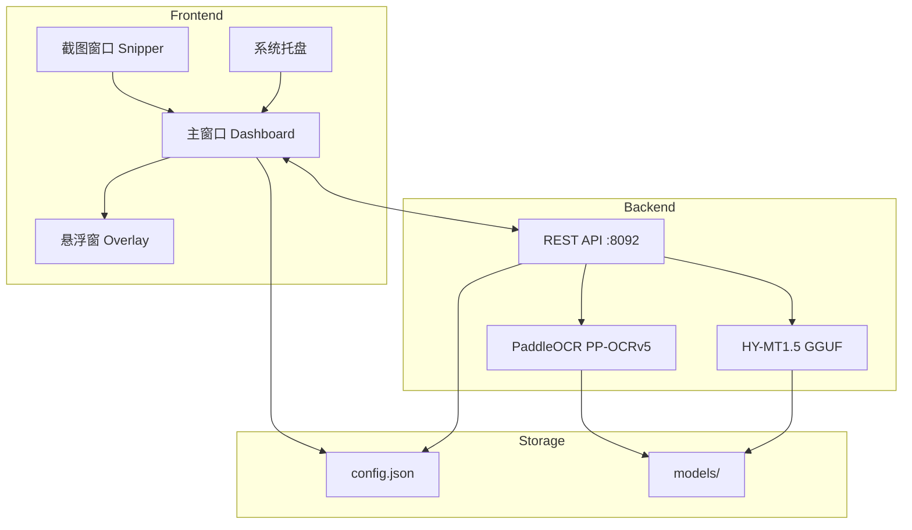

## 工作流程

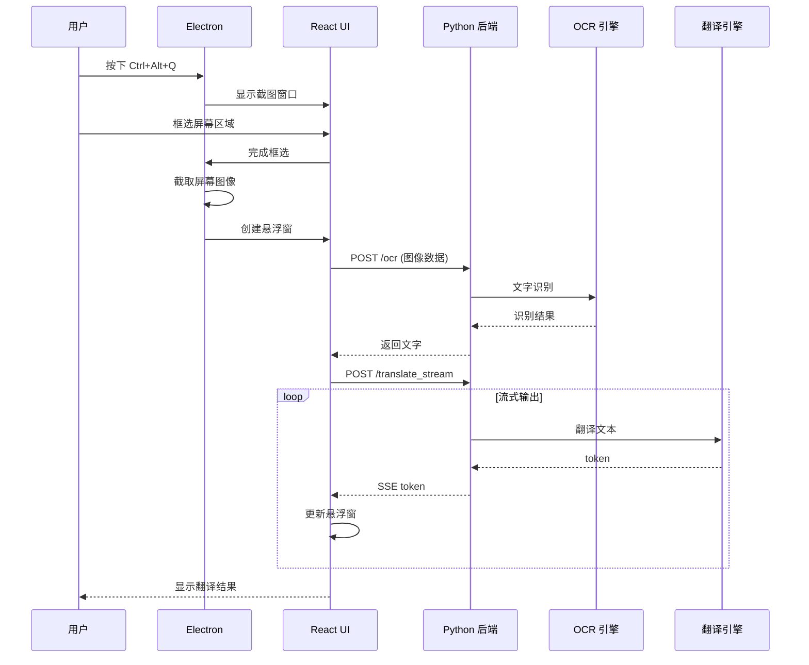

## 技术架构

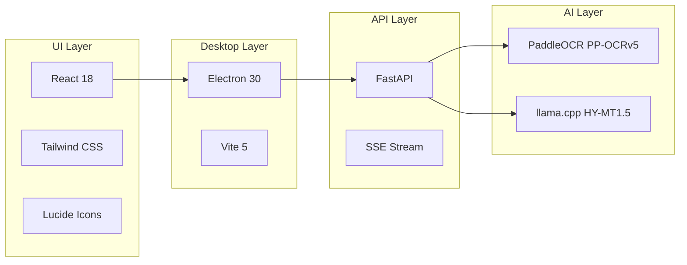

## 数据流

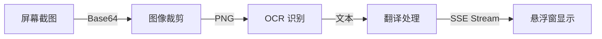

## 系统要求

- **操作系统**: Windows 10/11 (64-bit)
- **Python**: 3.10+
- **Node.js**: 18+
- **内存**: 建议 8GB 以上 (OCR + 翻译模型需要约 4-6GB)

## 快速开始

### 安装流程


### 1. 克隆仓库

```bash
git clone https://github.com/your-username/RSTA.git
cd RSTA
```

### 2. 一键安装依赖

使用 [uv](https://github.com/astral-sh/uv) 进行快速包管理（比 pip 快 10-100 倍）：

**Windows (PowerShell):**
```powershell
.\install.ps1
```

**Linux / macOS:**
```bash
chmod +x install.sh
./install.sh
```

**或使用 Python 脚本（跨平台）:**
```bash
python install.py
```

> 安装脚本会自动：
> - 检查并安装 uv
> - 创建 Python 虚拟环境
> - 安装 Python 依赖
> - 安装前端 npm 依赖

<details>
<summary>手动安装（不使用 uv）</summary>

```bash
# 创建虚拟环境
python -m venv .venv-hymt-gguf

# 激活虚拟环境
# Windows:
.venv-hymt-gguf\Scripts\activate
# Linux/macOS:
source .venv-hymt-gguf/bin/activate

# 安装 Python 依赖
pip install -r requirements.txt

# 安装前端依赖
cd web-ui
npm install
cd ..
```

</details>

### 3. 一键启动

```bash
python start.py
```

这会同时启动:
- Python 后端服务 (OCR + 翻译，端口 8092)
- Vite 开发服务器 (端口 5173)
- Electron 桌面应用

## 使用方法

### 快捷键

| 快捷键 | 功能 |
|--------|------|
| `Ctrl+Alt+Q` | 开始框选截图翻译 |
| `Ctrl+Alt+A` | 交换源语言和目标语言 |
| `Esc` | 取消框选 / 关闭悬浮窗 |

### 操作流程

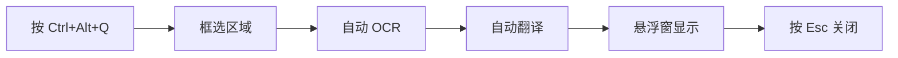

### 基本操作

1. 启动应用后，按 `Ctrl+Alt+Q` 进入框选模式
2. 拖动鼠标框选需要翻译的文字区域
3. 松开鼠标后自动进行 OCR 识别和翻译
4. 翻译结果显示在悬浮窗中，可拖动位置
5. 点击悬浮窗右下角按钮可展开/收起 OCR 原文
6. 按 `Esc` 或点击关闭按钮关闭悬浮窗

## 项目结构

```
RSTA/
├── start.py                 # 一键启动脚本
├── config.json              # 运行时配置文件
├── requirements.txt         # Python 依赖
├── rsta/                    # Python 核心模块
│   ├── config.py            # 配置加载
│   ├── ocr.py               # OCR 引擎封装
│   └── translators.py       # 翻译器封装
├── scripts/                 # 脚本工具
│   ├── serve_unified.py     # 统一后端服务 (OCR + 翻译)
│   ├── serve_hymt_gguf.py   # HY-MT GGUF 翻译服务
│   ├── deploy_hymt_gguf.ps1 # Windows 部署脚本
│   ├── deploy_unified.ps1   # 统一服务部署脚本
│   └── install_paddleocr.*  # PaddleOCR 安装脚本
├── web-ui/                  # Electron + React 前端
│   ├── electron/            # Electron 主进程
│   │   ├── main.js          # 主进程入口
│   │   └── preload.js       # 预加载脚本
│   ├── src/                 # React 前端源码
│   │   ├── App.jsx          # 主应用组件
│   │   └── main.jsx         # React 入口
│   └── package.json         # 前端依赖
└── models/                  # 模型缓存目录
```

### 模块依赖关系

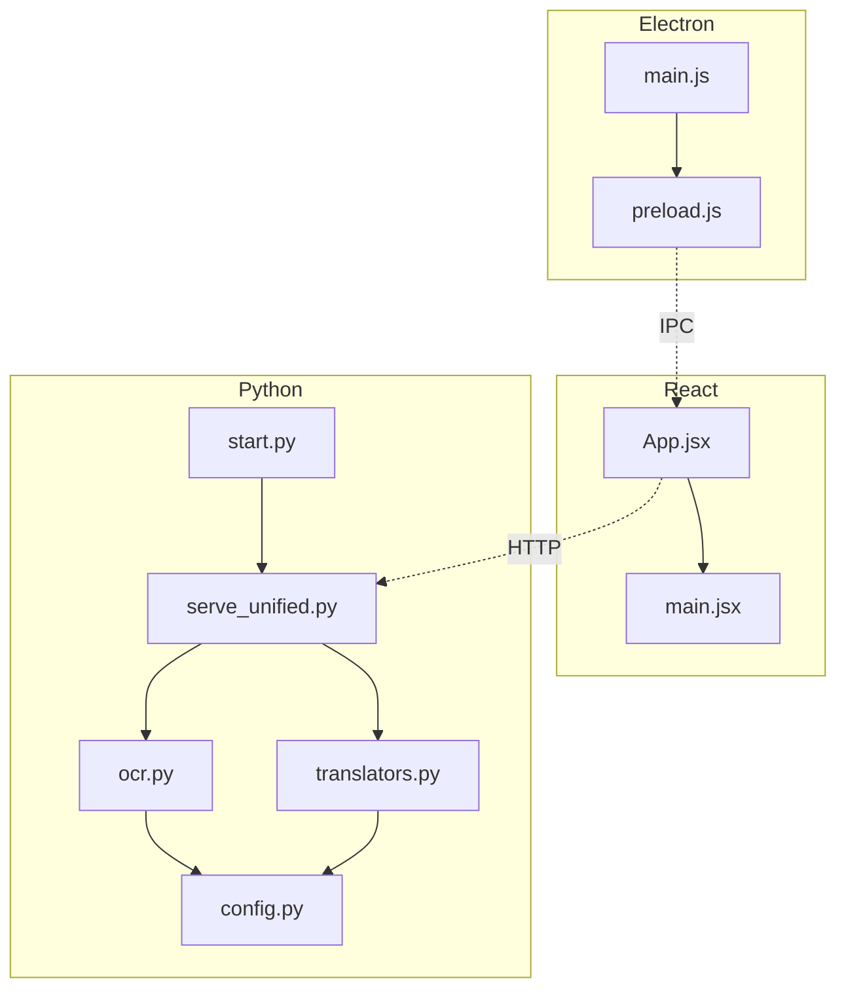

## 配置说明

配置文件 `config.json` 主要选项:

```json
{
  "hotkey": "Ctrl+Alt+Q",
  "swap_hotkey": "Ctrl+Alt+A",
  "source_lang": "en",
  "target_lang": "zh",
  "ocr_engine": "paddleocr",
  "translator": "unified",
  "paddleocr": {
    "model_type": "mobile",
    "use_gpu": false
  }
}
```

### 配置项说明

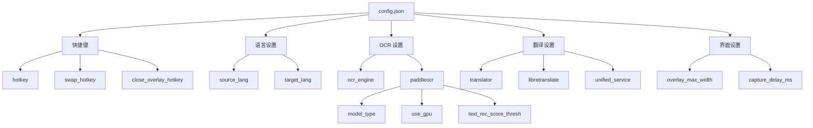

### 语言代码

| 代码 | 语言 | 代码 | 语言 |
|------|------|------|------|
| `en` | English | `zh` | 中文 |
| `ja` | 日本語 | `ko` | 한국어 |
| `fr` | Français | `de` | Deutsch |
| `es` | Español | `ru` | Русский |
| `pt` | Português | `it` | Italiano |

## 开发

### 服务启动顺序

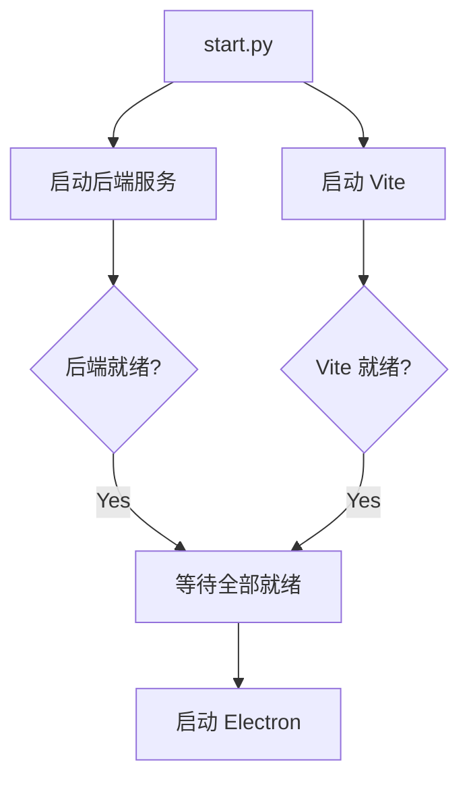

### 单独启动各服务

```bash
# 启动后端服务
python scripts/serve_unified.py

# 启动前端开发服务器
cd web-ui && npm run dev

# 启动 Electron (需要先启动 Vite)
cd web-ui && npm run start
```

### 构建生产版本

```bash
cd web-ui
npm run build    # 构建前端
npm run dist     # 打包 Electron 应用
```

## 技术栈

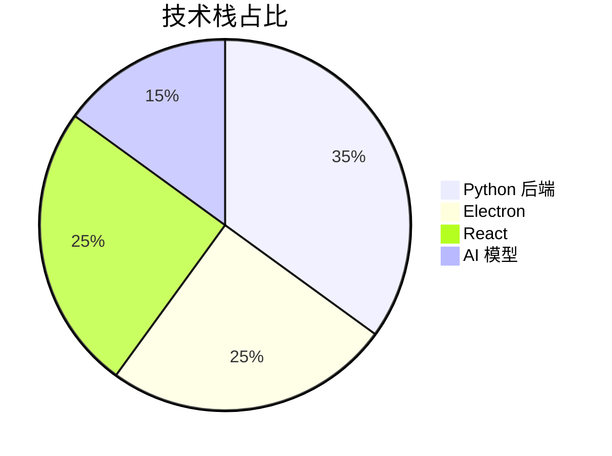

### 后端
- **Python 3.10+** - 主要开发语言
- **FastAPI** - HTTP API 服务
- **PaddleOCR (PP-OCRv5)** - OCR 文字识别
- **llama-cpp-python** - GGUF 模型推理
- **HY-MT1.5** - 机器翻译模型

### 前端
- **Electron 30** - 桌面应用框架
- **React 18** - UI 框架
- **Vite 5** - 构建工具
- **Tailwind CSS** - 样式框架
- **Lucide React** - 图标库

## API 接口


| 接口 | 方法 | 描述 |
|------|------|------|
| `/health` | GET | 服务健康检查 |
| `/ocr` | POST | OCR 文字识别 |
| `/ocr/preload` | POST | 预加载 OCR 模型 |
| `/translate` | POST | 文本翻译 |
| `/translate_stream` | POST | 流式翻译 (SSE) |
| `/config` | GET/POST | 获取/更新配置 |

## 常见问题

### 问题排查流程

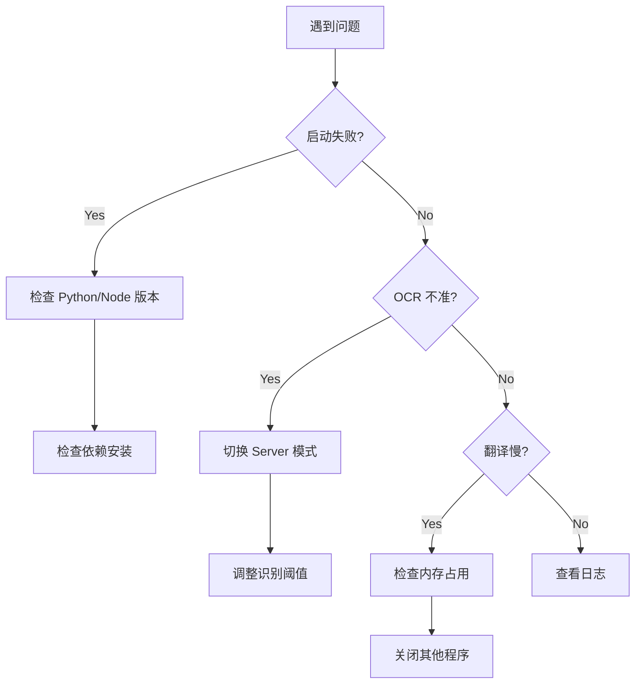

### Q: 首次启动很慢？
A: 首次启动需要加载 OCR 和翻译模型，约需要 30-60 秒。后续启动会更快。

### Q: OCR 识别不准确？
A: 可以尝试:
1. 在设置中将 OCR 模型切换为 `Server` 模式（更精准但较慢）
2. 调低文字识别阈值 `text_rec_score_thresh`
3. 确保框选区域清晰，避免过小

### Q: 翻译结果不理想？
A: HY-MT 模型主要针对中英互译优化。其他语言对的翻译质量可能较低。

### Q: 内存占用过高？
A: OCR 模型约需 1-2GB，翻译模型约需 3-4GB。建议使用 8GB 以上内存的设备。

## 路线图

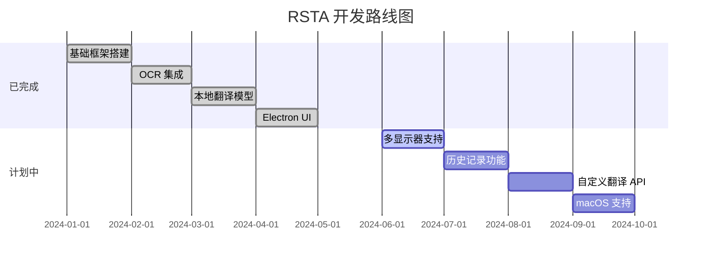

## 许可证

MIT License

## 致谢

- [PaddleOCR](https://github.com/PaddlePaddle/PaddleOCR) - 百度开源 OCR 引擎
- [HY-MT](https://github.com/huawei-noah/HY-MT) - 华为开源机器翻译模型
- [llama.cpp](https://github.com/ggerganov/llama.cpp) - GGUF 模型推理库
- [Electron](https://www.electronjs.org/) - 跨平台桌面应用框架

---

<p align="center">
  Made with :heart: by RSTA Team
</p>
